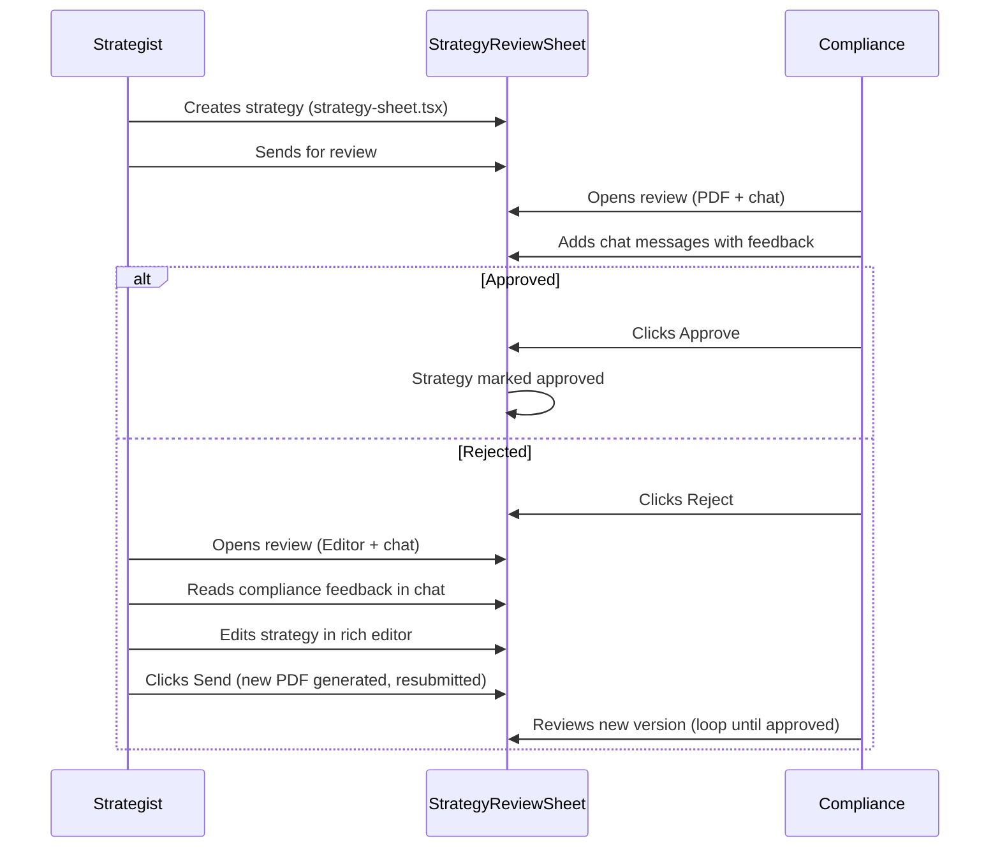

# Compliance Review Rework

## Summary

The previous implementation modified `strategy-sheet.tsx` to add a "review mode". That was wrong — `strategy-sheet.tsx` should stay untouched as the original editor.

Instead, a **new shared component** (`strategy-review-sheet.tsx`) handles the review flow for both roles:

- **Left column differs by role**:
  - **Compliance** — PDF viewer (read-only iframe)
  - **Strategist** — Rich text editor (same editor as `strategy-sheet.tsx`) so they can edit and create a new strategy version to resubmit for review
- **Right column (both roles)** — Chat interface for compliance/strategist communication
- **Top-right (compliance only)** — Approve / Reject buttons
- **Strategist "Send" action** — generates a new strategy PDF and sends it for compliance review again (cycle repeats until approved)

## Changes

### 1. Revert `strategy-sheet.tsx` to original

- `git checkout HEAD~1 -- src/components/strategy/strategy-sheet.tsx`
- Restores the original props, removes `ReviewComment`, `CommentsThread`, `StrategySheetReview`, and the discriminated union
- No further modifications — the editor stays as-is for initial strategy creation

### 2. Create new component: `src/components/compliance/strategy-review-sheet.tsx`

Shared component for strategy review + chat. Same visual style as `strategy-sheet.tsx` (animation, backdrop, close button, ESC keybind, two-column layout) but independent:

**Left column (role-based)**:
- `role === 'compliance'`: PDF viewer (iframe) — read-only view of the strategy
- `role === 'strategist'`: Rich text editor — reuses the same editor logic/components from [strategy-sheet.tsx](src/components/strategy/strategy-sheet.tsx) (TipTap/rich-text editor, page management, formatting toolbar). The strategist can edit the document and hit "Send" to generate a new PDF and resubmit for compliance review. No AI assistant in this view — just the editor.

**Right column (both roles)**:
- Chat interface — both compliance and strategist can send and read messages
- Reuse patterns from [chat-messages-list.tsx](src/components/chat/chat-messages-list.tsx) (scrollable list, auto-scroll), [chat-input.tsx](src/components/chat/chat-input.tsx) (auto-resizing textarea, Enter to send, emerald send button), [chat-message.tsx](src/components/chat/chat-message.tsx) (teal bubbles for current user, zinc for other)

**Top-right (compliance only)**:
- Approve / Reject buttons — only rendered when `role === 'compliance'`

**Props**:
- `isOpen`, `onClose`, `documentTitle`
- `role: 'compliance' | 'strategist'`
- `pdfUrl` — used by compliance to render iframe
- `client`, `agreementId` — used by strategist to load/save the strategy in the editor
- `comments`, `isLoadingComments`, `onAddComment`
- `onSend?` — strategist only: generates new PDF and resubmits strategy for review
- `onApprove?`, `onReject?`, `isApproving?`, `isRejecting?` — compliance only

### 3. Update strategist hook and page

[use-client-detail-data.ts](src/contexts/strategist-contexts/client-management/hooks/use-client-detail-data.ts):

- Keep `strategyComments`, `isLoadingStrategyComments` state and comment-fetching logic
- Keep `isStrategyReviewOpen` / `setIsStrategyReviewOpen`
- Change `handleViewStrategyDocument` to set `isStrategyReviewOpen = true` (opens StrategyReviewSheet instead of `window.open`)
- Add `handleAddStrategyComment` handler calling `addComplianceComment`
- Add `handleSendRevisedStrategy` handler that generates PDF, uploads, and resubmits (same flow as the existing Send in strategy-sheet)
- Update `ClientDetailData` interface

[strategist client page](src/app/(app)/strategist/clients/[clientId]/page.tsx):

- Remove the old `<StrategySheet mode="review" ...>` block
- Add `<StrategyReviewSheet role="strategist" ...>` passing `client`, `agreementId`, comments, `onSend`, `onAddComment`

### 4. Wire compliance page to new component

[compliance client page](src/app/(app)/compliance/clients/[clientId]/page.tsx):

- Replace `<StrategySheet mode="review" ...>` with `<StrategyReviewSheet role="compliance" ...>`
- Pass `pdfUrl`, comments, `onAddComment`, `onApprove`, `onReject`
- Keep Strategy button, sheet open state, approve/reject modal wiring

### 5. Compliance API cleanup

[compliance.api.ts](src/lib/api/compliance.api.ts):

- Keep `getComplianceDocumentUrl()` — will work once backend adds the endpoint
- Add `updateComplianceDocumentAcceptance()` — will work once backend adds the endpoint
- Remove debug logging

[use-compliance-client-detail.ts](src/contexts/compliance/hooks/use-compliance-client-detail.ts):

- Keep using `getComplianceDocumentUrl` for PDF URL resolution
- Wire approve/reject to compliance-scoped function (with fallback)
- Remove debug logging

---

## Review Cycle Flow

---

## Blocked by Backend

These items cannot be completed on the frontend until the backend team adds the endpoints:

**1. `PATCH /compliance/documents/{id}`**

- Needed for: compliance approve/reject strategy
- Body: `{ "acceptanceStatus": "ACCEPTED_BY_COMPLIANCE" }` (or `REJECTED_BY_COMPLIANCE`, `REQUEST_CLIENT_ACCEPTANCE`)
- Currently: `PATCH /documents/{id}` returns 403 for compliance users

**2. `GET /compliance/documents/{id}`**

- Needed for: compliance to view/download the strategy PDF
- Response: same shape as `GET /documents/{id}` (with `files[].downloadUrl` or `downloadUrl`)
- Currently: `GET /documents/{id}` returns 403, `/compliance/agreements/{id}/files` returns files without `downloadUrl`

Once these exist, the frontend functions `getComplianceDocumentUrl()` and `updateComplianceDocumentAcceptance()` in `compliance.api.ts` will work immediately — they already target these paths.
